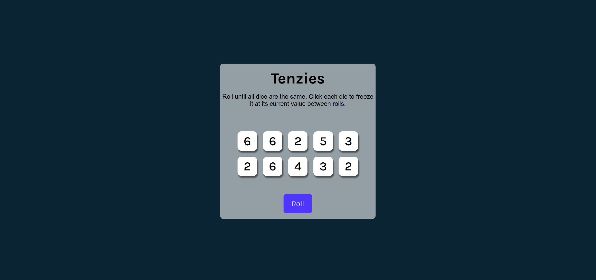
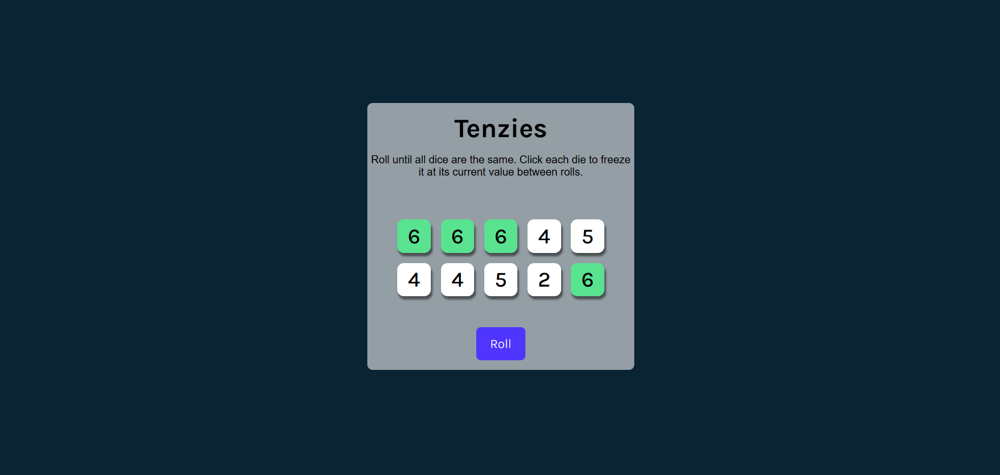
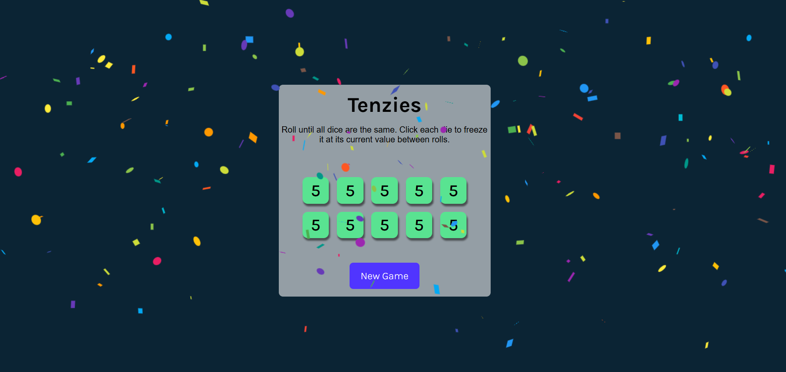

# Tensenzie
Tenzino is a mini dice game built with React, where players aim to match all dice numbers to win the game.

## Features
* Roll the dice
* Lock and unlock dice
* Reset the game
* Modern and responsive design
  
## Technologies Used
* React
* HTML/CSS
* JavaScript
  
  ## Illustration 
1. Start page 

2. Playing process 

3. Winning game 

## How to Play

1. Click on the dice to lock the desired number.
2. Roll the dice to change the unlocked ones.
3. Try to match all dice to the same number.
4. Once all dice match, you win!

=======
# mini_tensenzie
A fast and fun mini Tensenzi game where you roll the dice, match numbers! Built with React for a smooth and engaging experience.
